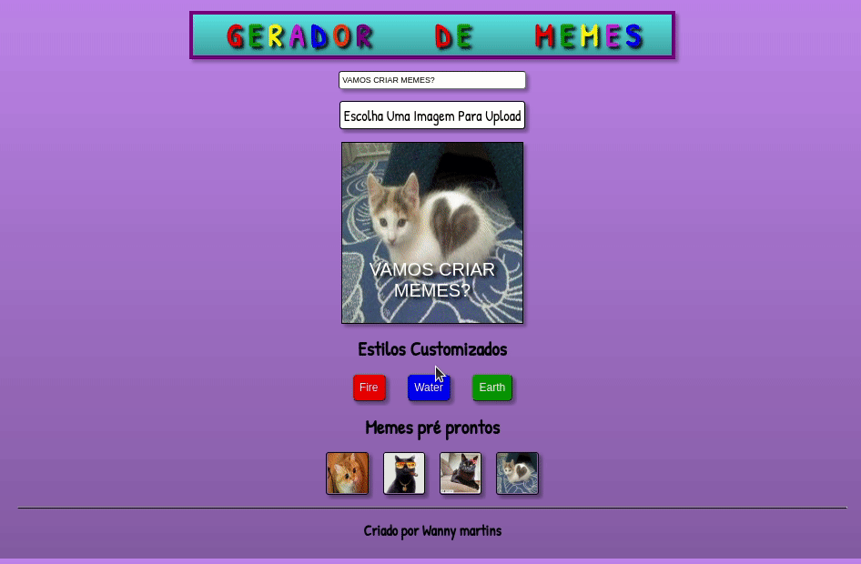

<h1 align="center">Bem Vindo ao Meme Generator 👋</h1>

>  Esta aplicação permite ao usuário criar memes divertidos de maneira fácil, e também pode personalizar escrita, imagem.
Projeto criado para consolidar conhecimentos adquiridos durante o módulo de **Fundamentos em desenvolvimento web na Trybe**.

## Ferramentas utilizadas

- HTML,
- CSS,
- JavaScript

## Como usar

Basta acessar clicando na _Homepage_

### 🏠 [Homepage](https://wannymartins.github.io/Project---Meme-Generator/)

## Autor

👤 **Wanny Martins**

* Github: [@WannyMartins](https://github.com/WannyMartins)
* LinkedIn: [@wannymartins](https://linkedin.com/in//wannymartins\/)

